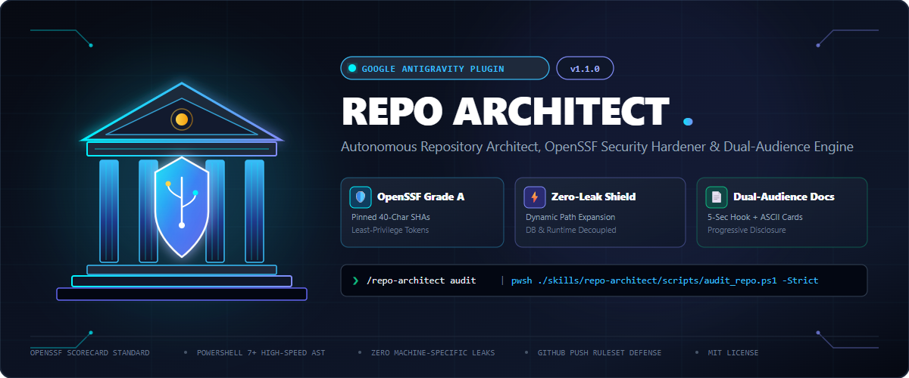

# 🏛️ antigravity-repo-architect-plugin

<p align="center">
  
</p>

<p align="center">
  <a href="https://github.com/karansinghverma979/antigravity-repo-architect-plugin/actions/workflows/ci.yml">
    
  </a>
  <a href="https://securityscorecards.dev">
    
  </a>
  <a href="https://opensource.org/licenses/MIT">
    
  </a>
  <a href="https://github.com/PowerShell/PowerShell">
    
  </a>
  <a href="https://github.com/karansinghverma979/antigravity-repo-architect-plugin">
    
  </a>
  <a href="#">
    
  </a>
</p>

> **Autonomous GitHub Repository Architect, OpenSSF Security Hardener & Dual-Audience Documentation Engine for Google Antigravity.**

An enterprise-grade Antigravity plugin engineered to bridge the gap between building tools locally on a developer workstation and publishing world-class, production-ready repositories on GitHub. It combines an autonomous AI agent (`repo_architect`), specialized skills, a Win32/PowerShell 7 audit engine (`audit_repo.ps1`), and OpenSSF supply-chain hardening playbooks.

---

## 🎨 Brand Assets & Design Poster

The repository comes equipped with high-resolution vector and raster branding assets designed for GitHub releases, docs, and banners:

| Asset | Type | Dimensions | Preview / File Link |
| :--- | :--- | :--- | :--- |
| **Hero Poster / Banner** | Vector SVG & 4K PNG | 1200 × 500 | [`assets/poster.svg`](assets/poster.svg) • [`assets/poster.png`](assets/poster.png) |
| **Brand Logo / Icon** | Vector SVG & Crisp PNG | 512 × 512 | [`assets/logo.svg`](assets/logo.svg) • [`assets/logo.png`](assets/logo.png) |

```text
┌─────────────────────────────────────────────────────────────────────────┐
│                           REPO ARCHITECT BRAND                          │
├─────────────────────────────────────────────────────────────────────────┤
│  [ Classical Portico / Pillars ] ──► Structural Repository Architecture │
│  [ Illuminated Cyber Shield ]    ──► OpenSSF Sentry & SLSA Hardening    │
│  [ Dynamic Node Graph & Key ]    ──► Zero-Leak Workstation Quarantine   │
└─────────────────────────────────────────────────────────────────────────┘
```

---

## 🏛️ Architecture

```text
antigravity-repo-architect-plugin/
├── assets/
│   ├── poster.png                        # High-resolution hero banner poster
│   ├── poster.svg                        # Vector widescreen repository poster
│   ├── logo.png                          # High-resolution brand logo icon
│   ├── logo.svg                          # Vector brand logo icon
│   └── banner.svg                        # Alternative banner distribution
├── agents/
│   └── repo_architect.md                 # Autonomous Agent definition
├── plugin.json                           # Antigravity Plugin manifest
├── skills/
│   └── repo-architect/
│       ├── SKILL.md                      # Antigravity Skill instructions & command router
│       ├── scripts/
│       │   ├── audit_repo.ps1            # 50ms high-speed security, path & OpenSSF auditor
│       │   └── scaffold_repo.ps1         # Canonical repository scaffolder
│       ├── templates/
│       │   ├── ruleset_branch_baseline.json # GitHub default branch protection ruleset
│       │   └── ruleset_push_baseline.json   # GitHub push quarantine ruleset (*.sqlite, *.env, >50MB)
│       └── references/
│           ├── archetype_blueprints.md   # CLI, MCP, Python, Web layouts
│           ├── dual_audience_readme_spec.md # Non-tech + peer dev progressive disclosure
│           ├── github_official_best_practices.md # GitHub & MS Learn security, CodeQL, LFS
│           ├── github_rulesets_governance.md # Server-side push quarantine & ruleset API
│           ├── motobook_github_coexistence.md # 4-Wall Quarantine & path invariants
│           ├── openssf_scorecard_hardening.md # Token least-privilege & SHA pinning
│           └── vibe_security_defense.md  # 5-Pass Pre-Launch Security (Gitleaks, Bearer, ECC)
├── .github/
│   ├── dependabot.yml                    # Automated dependency monitoring
│   ├── ISSUE_TEMPLATE/                   # Bug report & feature request templates
│   ├── PULL_REQUEST_TEMPLATE.md          # Standardized PR review checklist
│   └── workflows/
│       └── ci.yml                        # OpenSSF-hardened syntax & schema validation CI
├── .gitattributes                        # CRLF/LF line-ending firewall
├── .gitignore                            # Motobook runtime quarantine
├── LICENSE                               # MIT License
├── README.md                             # Dual-Audience documentation
└── SECURITY.md                           # OpenSSF vulnerability disclosure protocol
```

---

## ⚡ The 3 Sovereign Repo Lenses

```text
┌─────────────────────────────────────────────────────────────┐
│                 THE 3 SOVEREIGN REPO LENSES                 │
├───────────────────┬───────────────────┬─────────────────────┤
│ 🛡️ THE HACKER     │ 🛠️ THE DEVELOPER   │ ⚡ THE END-USER     │
│   (Cyber-Security)│   (Peer / Contrib)│   (Non-Tech / Nerd) │
├───────────────────┼───────────────────┼─────────────────────┤
│ • OpenSSF Grade A │ • Clean Layout    │ • 5-Second Hook     │
│ • Pinned Action   │ • Separated src/  │ • 1-Line Quickstart │
│   Commit SHAs     │   and tests/      │ • Pre-Compiled      │
│ • Zero Path Leaks │ • Full Dev Loop   │   Standalone .exe   │
│ • Zero Secrets    │ • API Contracts   │ • Zero Jargon       │
└───────────────────┴───────────────────┴─────────────────────┘
```

---

## 🚀 Quickstart

### Option A: Using inside Google Antigravity
The plugin is automatically discovered by Antigravity in `~/.gemini/config/plugins/repo-architect-plugin/`.

Trigger it with natural language or slash commands in chat:
```text
/repo-architect audit
/repo-architect scaffold cli
/repo-architect vibe-security
/repo-architect readme
/repo-architect secure
/repo-architect ship
```

### Option B: Standalone PowerShell CLI
Run the high-speed security and path auditor directly in any repository:
```powershell
pwsh -NoProfile -File ~/.gemini/config/plugins/repo-architect-plugin/skills/repo-architect/scripts/audit_repo.ps1 -Strict
```

Or scaffold a new repository archetype:
```powershell
pwsh -NoProfile -File ~/.gemini/config/plugins/repo-architect-plugin/skills/repo-architect/scripts/scaffold_repo.ps1 -Archetype cli
```

---

## ⚡ Core Capabilities

1. **📊 50ms High-Speed Repository Audit (`audit`)**:
   - **Path Portability**: Recursively scans all source files for hardcoded local user paths (`C:\Users\<username>\...`, `%USERPROFILE%`).
   - **Secret Shield**: Detects high-entropy API tokens (GitHub, OpenAI, GCP, AWS, Slack) and flags unignored `.env` files.
   - **State Quarantine**: Detects persistent databases (`*.sqlite`, `*.db`) inside the git working tree.
   - **Line-Ending Firewall**: Verifies `.gitattributes` presence and enforces Unix LF for shell scripts to prevent bash syntax crashes on Linux/CI.
   - **OpenSSF Workflow Check**: Audits GitHub Action workflows for mutable version tags (`@v4`) and verifies top-level `permissions: contents: read`.
   - **Community Standards**: Checks for `README.md`, `LICENSE`, and `SECURITY.md`.

2. **🧱 The 4-Wall Motobook ⇄ GitHub Quarantine**:
   - Solves the everyday challenge of developing and running code locally while syncing live to GitHub:
      - *Wall 1: Runtime State Decoupling* (stores state in `%LOCALAPPDATA%` or ignored directories).
      - *Wall 2: Zero-Config Dynamic Path Resolution* (dynamic expansion via standard libraries).
      - *Wall 3: Dual-Stage Environment Shield* (`.env` ignored, `.env.example` committed).
      - *Wall 4: CRLF/LF Line-Ending Firewall* (`.gitattributes` rules).
      - *Wall 5: Server-Side Push Ruleset Quarantine* (GitHub push ruleset hard-rejects `*.sqlite`, `.env`, >50MB files at the edge).

3. **🏗️ Canonical Archetype Scaffolding (`scaffold`)**:
   - Generates production-ready configurations tailored to the project type:
     - **Standalone CLI** (.NET / Rust / Go) + cross-platform binary release pipeline.
     - **Antigravity Customization Plugin / MCP Server** with STDIO manifests.
     - **Modern Python Package** (PEP 518/621 `src/` layout with `pyproject.toml`).
     - **Modern Fullstack Web Application** with frontend/backend isolation.

4. **📄 Dual-Audience README Engine (`readme`)**:
   - Enforces Progressive Disclosure: 5-second visual hook (poster + ASCII box card) and 30-second quickstart for end-users, with deep architectural links (`docs/architecture.md`) for engineers.

5. **🔒 OpenSSF Supply Chain Hardening & GitHub Rulesets (`secure`)**:
   - Automatically injects pinned 40-character commit SHAs, least-privilege token permissions, and automated Dependabot configuration.
   - Provides declarative GitHub Ruleset templates (`ruleset_branch_baseline.json`, `ruleset_push_baseline.json`) to enforce branch tamper resistance and server-side push filtering via GitHub API or web UI.

6. **🛡️ 5-Pass Vibe-Coding Pre-Launch Defense (`vibe-security`)**:
   - Evaluates applications against real-world breach patterns:
     - *Pass 1 (Gitleaks)*: Scans for frontend prefix leaks (`NEXT_PUBLIC_`, `REACT_APP_`, `VITE_`), Supabase RLS gaps, and client-side Stripe secrets.
     - *Pass 2 (Bearer)*: Audits personal data flows, PII in `console.log`, and enforces `httpOnly` cookies over `localStorage`.
     - *Pass 3 (ECC Production Audit)*: Enforces startup environment validation, debug endpoint cleanup, generic error masking, and HTTP security headers.
     - *Pass 4 (Trail of Bits)*: Validates IDOR protection, sovereign server-side payment logic, and SQL/XSS input sanitization.
     - *Pass 5 (ECC Security Review)*: Probes privilege escalation, admin backdoor endpoints, and business logic exploits.

---

## 🛠️ Development & Contributing

### Local Verification
Run the auditor against the plugin itself:
```powershell
pwsh -NoProfile -File ./skills/repo-architect/scripts/audit_repo.ps1 -Strict
```

For detailed architectural specs, see:
- [GitHub Rulesets & Sovereign Governance](skills/repo-architect/references/github_rulesets_governance.md)
- [GitHub & Microsoft Official Best Practices](skills/repo-architect/references/github_official_best_practices.md)
- [5-Pass Vibe-Coding Security Defense](skills/repo-architect/references/vibe_security_defense.md)
- [OpenSSF Scorecard Hardening Guide](skills/repo-architect/references/openssf_scorecard_hardening.md)
- [The Motobook ⇄ GitHub Co-existence Guide](skills/repo-architect/references/motobook_github_coexistence.md)
- [Dual-Audience README Specification](skills/repo-architect/references/dual_audience_readme_spec.md)
- [Canonical Archetype Blueprints](skills/repo-architect/references/archetype_blueprints.md)

---

## 🛡️ Security & License

- **Security Disclosures**: Please see our [Security Policy](SECURITY.md) to report vulnerabilities privately.
- **License**: Distributed under the [MIT License](LICENSE).
